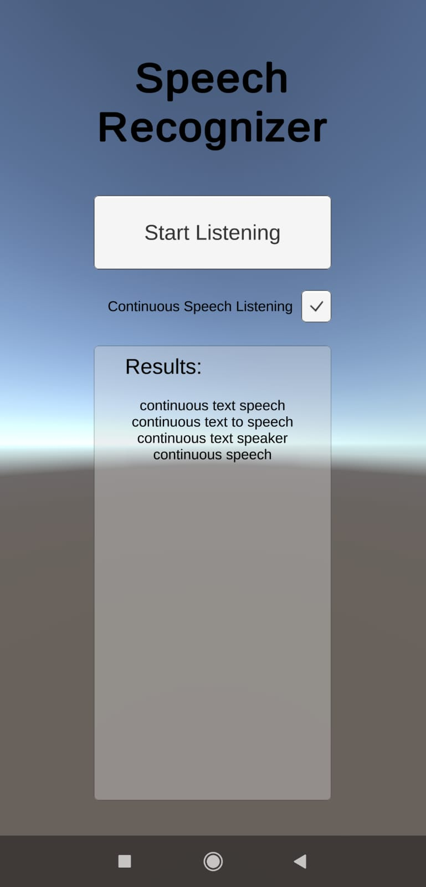

# UnityAndroidSpeechRecognizer 🗣️
*Created by Eric Batlle Clavero*

 A simple **Android App** made with **Unity** that implements a **Speech Recognizer** using Android native recognizer. 

**Without** the annoying **pop-up** and the option to keep the app **listening indefinitely**, not just once.

This repository is divided in 2 parts:

- Unity Project (**C#**)
- Android Plugin (**Java**)

## Example 🎬

<p>
  
</p>

*In this image it is possible to see multiple results appearing on the panel after speaking to the device "continuous text speech". *

## Donations are appreciated! 💸
*Remember that are many ways to say thank you.*

If this plugin has been helpful remember to star the repository and consider buying me a coffee! 😀 
<p>
<a href="https://www.buymeacoffee.com/ebatlleclavero" target="_blank"></a>
</p>

If you like my general work and contributions consider [sponsoring me on Github](https://github.com/sponsors/EricBatlle). 

But if you just want to donate straightforward, I also have [PayPal.me](https://paypal.me/EricBatlleClavero?locale.x=es_ES).

## How to Install :hammer_and_wrench:	

- If you want to install the the app, you can download the APK from [here](https://github.com/EricBatlle/UnityAndroidSpeechRecognizer/releases/download/v1.3/SpeechRecognizer_1.3.apk).

- If you want to install the whole project and check the code, you need to have **Unity** and **AndroidStudio** installed and updated.

- If you want to install only the few files to make the plugin work and don't want the whole project, you only need to import the package **SpeechRecognizer_pckg** located inside ``UnitySpeechRecognizer/Assets/``. To import it simply drag and drop the file in your current Unity project.

## How to Use ⚙️

#### How to use the Demo:
- Functionality is simple, just press the **Start Listening button** and talk to your device to check the results! 
- If you want to enable/disable continuous listening mode simply press the **Continous Listening checkmark**.
- You can also stop the current recongizer by pressing the **Stop Listening button**.
- Set the language of the recognizer or the maximum results you want that the recognizer retrieves.

#### How to use the Plugin:

To call the plugin you first need  a variable to reference it:
```csharp
private SpeechRecognizerPlugin plugin = null;
```
Then you have to create a new platform-specific instance by calling:
```csharp
plugin = SpeechRecognizerPlugin.GetPlatformPluginVersion(this.gameObject.name);
```
Notice that ``this.gameObject.name`` is the name of the GameObject that will have the plugin callback methods to retrieve the recognition results and errors.
To create those callbacks you need to add and implement the Interface ```ISpeechRecognizerPlugin``` on the same GameObject. A common implementation of the interface will be:
```csharp
public void OnResult(string recognizedResult)
{
    char[] delimiterChars = { '~' };
    string[] results = recognizedResult.Split(delimiterChars);

    //Do something with the results
}

public void OnError(string recognizedError)
{
    ERROR error = (ERROR)int.Parse(recognizedError);
    switch (error)
    {
        case ERROR.UNKNOWN:
            Debug.Log("<b>ERROR: </b> Unknown");
            break;
        case ERROR.INVALID_LANGUAGE_FORMAT:
            Debug.Log("<b>ERROR: </b> Language format is not valid");
            break;
        default:
            break;
    }
}
```
From so on every time you want to call any plugin feature you only have to call it like any other object:

Do you want to start the recognition?
```csharp
plugin.StartListening();
```
Do you want to stop it?
```csharp
plugin.StopListening();
```
Do you want to start the recognition with continous recognition and specific language?
```csharp
plugin.StartListening(true, "es-ES");
```

#### How to scratch the code:
- To check **Unity** project, **open the project**, select **SpeechRecognizer** scene.
Either inside the unity project or simply dragging the **.cs** classes on your editor, you have to watch on to the classes located on ``UnitySpeechRecognizer/Assets/Scripts``. 
- To check **Android Plugin** you can do it opening the solution with **AndroidStudio** or just drag the ``SpeechRecognizerFragment.java`` class located on ``UnitySpeechRecognizerPlugin\SpeechRecognizer\src\main\java\com\example\eric\unityspeechrecognizerplugin``


## Multiple plugins support 🔌
This plugin has been made following a **fragment-pattern** to avoid errors that can be derived from extending *UnityPlayerActivity*.

This way you can integrate this plugin with your projects even if they already have more plugins. **Truly pluggable**.

## Upgrading dependencies 📜

Keep in mind that the actual release ([v1.3](https://github.com/EricBatlle/UnityAndroidSpeechRecognizer/releases/tag/v1.3)) of the plugin works with **AndroidX** dependencies. That means that is targeting **Android 9** (API level 28).

If you want to target older versions I recommend to use the old version of the plugin ([v1.0]((https://github.com/EricBatlle/UnityAndroidSpeechRecognizer/releases/tag/v1.0))) that works with **Android Support v4**. *But remember that some features like specify recognition language aren't available for the moment.* You can download the old plugin source code and APK from [here](https://github.com/EricBatlle/UnityAndroidSpeechRecognizer/releases/tag/v1.0).
