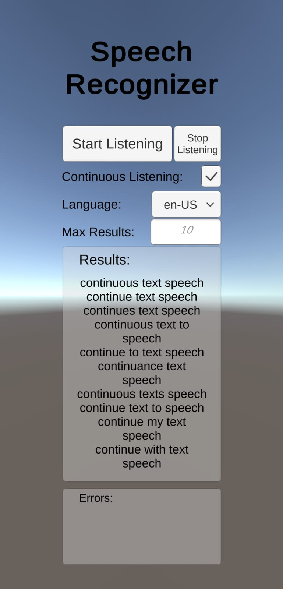

# UnityAndroidSpeechRecognizer 🗣️
*Created by Eric Batlle Clavero*

 A simple **Android App** made with **Unity** that implements a **Speech Recognizer** using Android native recognizer. 

**Without** the annoying **pop-up** and the option to keep the app **listening indefinitely**, not just once.

This repository is divided in 2 parts:

- Unity Project (**C#**)
- Android Plugin (**Java**)

## Example 🎬

  

*In this image it is possible to see 4 results appearing on the panel after speaking to the device "continuous text speech".*

## Donations are appreciated! 💸
*Remember that are many ways to say thank you.*

If this plugin has been helpful remember to star the repository and consider buying me a coffee! 😀 

If you like my general work and contributions consider [sponsoring me on Github](https://github.com/sponsors/EricBatlle). 

But if you just want to donate straightforward, I also have [PayPal.me](https://paypal.me/EricBatlleClavero?locale.x=es_ES).

## How to Use ⚙️

If you want to test the app, you can download the APK from [here](https://github.com/EricBatlle/UnityAndroidSpeechRecognizer/releases/download/v1.2/SpeechRecognizer_1.2.apk).

If you want to open the project and check the code, you need to have **Unity** and **AndroidStudio** installed and updated.

If you want to scratch the code:

- To check **Unity** project, **open the project**, select **SpeechRecognizer** scene.
Either inside the unity project or simply dragging the **.cs** classes on your editor, you have to watch on to the classes located on ``UnitySpeechRecognizer/Assets/Scripts``. 
- To check **Android Plugin** you can do it opening the solution with **AndroidStudio** or just drag the ``SpeechRecognizerFragment.java`` class located on ``UnitySpeechRecognizerPlugin\SpeechRecognizer\src\main\java\com\example\eric\unityspeechrecognizerplugin``

Functionality is simple, just press the checkmark if you want to enable/disable continuous listening mode, press Start listening and talk to your device to check the results!

#### Multiple plugins support 🔌
This plugin has been made following a **fragment-pattern** to avoid errors that can be derived from extending *UnityPlayerActivity*.

This way you can integrate this plugin with your projects even if they already have more plugins. **Truly pluggable**.

#### Upgrading dependencies 📜

Keep in mind that the actual release ([v1.2](https://github.com/EricBatlle/UnityAndroidSpeechRecognizer/releases/tag/v1.2)) of the plugin works with **AndroidX** dependencies. That means that is targeting **Android 9** (API level 28).

If you want to target older versions I recommend to use the old version of the plugin ([v1.0]((https://github.com/EricBatlle/UnityAndroidSpeechRecognizer/releases/tag/v1.0))) that works with **Android Support v4**. You can download the old plugin source code and APK from [here](https://github.com/EricBatlle/UnityAndroidSpeechRecognizer/releases/tag/v1.0).
